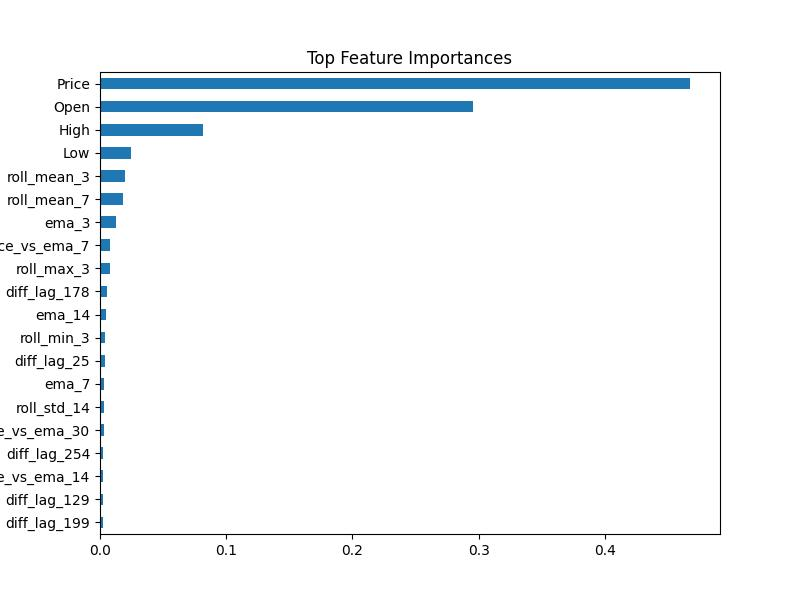
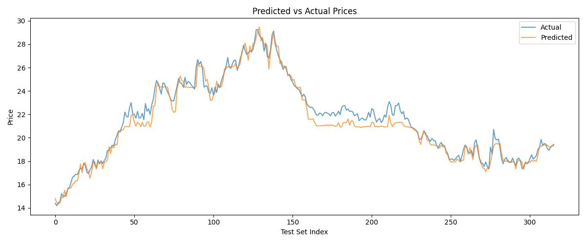

# Dutch TTF Natural Gas Price Forecasting

## Overview
This project focuses on forecasting front-month Dutch TTF (Title Transfer Facility) natural gas futures prices, a key benchmark for European natural gas markets. The goal is to model short-term price dynamics using time-series analysis and machine learning, with potential applications in algorithmic trading, hedging, and risk management.

The project uses historical futures data (TFAc1 ticker from Investing.com) and employs both statistical models (ARIMA) and machine learning models (XGBoost) to capture temporal dependencies, trends, and seasonality.

## Project Motivation
Dutch TTF is the leading European gas price hub, widely used for trading and hedging natural gas contracts. Accurate short-term price forecasts are critical for energy trading firms to optimize strategies and manage risk. This project aims to:
- Analyze historical TTF front-month futures prices.
- Identify seasonal and non-seasonal patterns using statistical tools.
- Engineer predictive features based on lagged returns, rolling windows, and calendar patterns.
- Build and evaluate forecasting models (ARIMA, SARIMA, XGBoost).
- Provide a reproducible, interpretable forecasting pipeline.

## Methodology
The project follows a structured approach to time-series forecasting:

1. **Data**:
   - **Source**: Continuous front-month TTF futures prices (TFAc1) from Investing.com, representing a rolling time series of the nearest expiring contract.
   - **Rationale**: Front-month contracts are liquid, reflect current market sentiment, and provide stable data for short-term modeling.
   - **Limitation**: The dataset does not support long-term forward curve modeling (e.g., Q1 2026 prices).
   - **Preprocessing:** Cleaned missing values, standardized date format, and ensured daily frequency.

2. **Exploratory Data Analysis (EDA)**:
   - Plotted time series trends.
   - Performed seasonal decomposition (trend, seasonal, residual).
   - Conducted Augmented Dickey-Fuller (ADF) test:
      - Original series: non-stationary (p = 0.22).
      - After differencing: stationary (p < 0.001).

3. **Lag Identification**:
   - Performed ACF and PACF analysis on differenced and seasonally differenced series.
   - Identified significant lags:
      - Non-seasonal: 1, 2, 4, 5, 25, 29, 35, etc.
      = Strong seasonal spike: Lag 365 (ACF ≈ -0.50).
   - Saved lag information to outputs/significant_lags_acf_pacf_seasonally_differenced_series.txt

4. **Statistical Modeling**:
   - Trained ARIMA(4,1,4) as baseline.
      - Residuals passed Ljung-Box test.
      - AIC ≈ 11,589.
   - Planned SARIMA(2,1,2)(0,1,1,365) and SARIMA(5,1,5)(0,1,1,365) but postponed due to local resource constraints.

5. **Feature Engineering for ML Model**:
   - Created over 60 features including:
      - Lagged returns: diff_lag_1, diff_lag_25, etc.
      - Seasonal lags: seasonal_return_lag, diff_lag_365, etc.
      - Rolling windows: roll_mean_3, roll_std_7, roll_max_30, etc.
      - Exponential moving averages: ema_3, ema_7, ema_30, etc.
      - Calendar features: month, day_of_week, is_weekend

6. **Feature Selection**:
   - Used XGBRegressor to estimate feature importance.
   - Retained top features with importance > 0.001 (approx. 35 features).
   - Final selected features included: Price, Open, roll_mean_3, diff_lag_25, seasonal_return_lag, ema_3, etc.
   

7. **Model Training (XGBoost)**:

   - Final model configuration:
      ''' final_model = XGBRegressor(
      max_depth=4,
      n_estimators=300,
      learning_rate=0.05,
      subsample=0.8,
      colsample_bytree=0.8,
      reg_lambda=1,
      reg_alpha=0.5,
      random_state=42
   ) '''
   - Trained on reduced feature set.
   - Saved model to models/final_xgb_model.pkl
   - Saved selected features to models/final_selected_features.pkl

8. **Evaluation**:
   - **Metrics** on test set:
      - MAE: 0.4987
      - RMSE: 0.6444
      - R²: 0.9622

   

   - Residual analysis and SARIMA comparison omitted to focus on ML workflow.


## Dependencies
Listed in `requirements.txt`:
```
pandas
numpy
matplotlib
statsmodels
scikit-learn
xgboost
```

